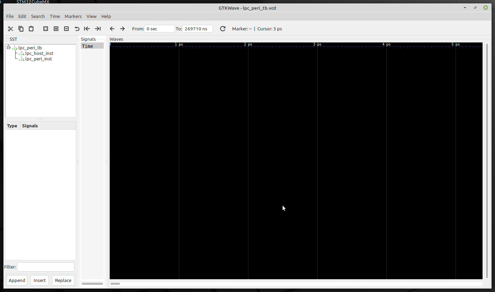
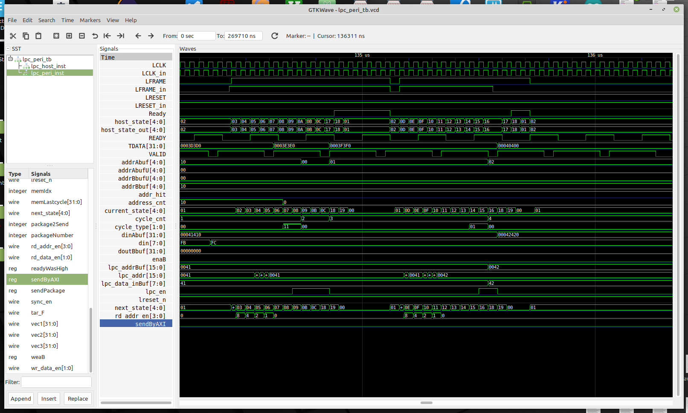

# Intro

This is FPGA based implementation of Low Pint Count (LPC) protocol written in
Verilog HDL language. The implementation is based on
[OpenCores](https://opencores.org/websvn/listing?repname=wb_lpc&path=%2Fwb_lpc%2Ftrunk%2Frtl%2Fverilog%2F#path_wb_lpc_trunk_rtl_verilog_)
by Howard M. Marte.

Such subset of LPC protocol cycles are supported:

- I/O Read and Write (1-byte)
- TPM cycle Read and Write (1-byte)

All sources are written in Verilog and could be synthesized in open-source
tools for example [Symbiflow](https://github.com/SymbiFlow).

It can be also easily simulated in open-source Verilog simulator - [Icarus
Verilog](http://iverilog.icarus.com/) and visualized in the
[GTKWave](http://gtkwave.sourceforge.net/).

## Simulation

### Prerequisites

Here is short tutorial how to simulate `LPC Peripheral` using the
`Icarus Verilog` and `GTKWave` packages.

First of all we, have to install `Icarus Verilog` package in your Linux
distribution. One can succeed this task in two ways:

- [installation from sources](https://iverilog.fandom.com/wiki/Installation_Guide)
- [installation from package repository](https://zoomadmin.com/HowToInstall/UbuntuPackage/iverilog)

You can also start with a
[short tutorial](https://iverilog.fandom.com/wiki/Getting_Started) showing how
to perform basic tasks in the `Icarus Verilog` tool.

After installation is done, we can try to run simulation of Verilog sources.
Apart from making sources for Verilog module, making test-bench in Verilog is
a must. So summing it up, we need to have two Verilog files:
- tested module sources
- test-bench with stimulus for tested package

### Running simulation

1. Create catalog for sources files, for example:

```bash
mkdir test
cd test
```

2. Clone this repository:

```bash
git clone https://github.com/lpn-plant/lpntpm-lpc-verilog.git
```

4. Now we can compile the Verilog module (source) to a format which Verilog
   simulator understands:

```bash
iverilog -o lpc_peri_module lpc_periph_tb.v lpc_periph.v lpc_host.v
```

> It is likely that one can see a few warnings - these are not that important
> right now and we can just skip them

5. After compilation has ended, we can use `vvp` tool to generate the `.vcd`
   file with timing simulation content:

```bash
vvp -nv lpc_peri_module
```

You should see similar output from tool:

```
Compiling VVP ...
 ... VVP file version 10.3 (stable)
Compile cleanup...
 ... Linking
 ... Removing symbol tables
 ... Compiletf functions
 ...      393 functors (net_fun pool=524288 bytes)
                261 logic
                  1 bufif
                  1 resolv
                 55 signals
 ...      378 filters (net_fil pool=524288 bytes)
 ...     1329 opcodes (49152 bytes)
 ...      113 nets
 ...      393 vvp_nets (1048544 bytes)
 ...        0 arrays (0 words)
 ...        2 memories
                  2 logic (40 words)
                  0 real (0 words)
 ...        4 scopes
 ... 0.023095 seconds, 16048.0/7420.0/4992.0 KBytes size/rss/shared
Running ...
 ...execute EndOfCompile callbacks
 ...propagate initialization events
 ...execute StartOfSim callbacks
 ...run scheduler
VCD info: dumpfile lpc_peri_tb.vcd opened for output.
 ...execute Postsim callbacks
 ... 0.135149 seconds, 16048.0/7420.0/4992.0 KBytes size/rss/shared
Event counts:
       13946 time steps (pool=128)
       34643 thread schedule events
       44479 assign events
             ...assign(vec4) pool=9362
             ...assign(vec8) pool=204
             ...assign(real) pool=256
             ...assign(word) pool=128
             ...assign(word/r) pool=204
      147768 other events (pool=4096)
```

As a result, `lpc_periph_tb.vcd` file containing simulation results (timing
diagrams) will be produced.

5. To see simulation results in graphical tool:

```bash
gtkwave lpc_periph_tb.vcd
```

6. After `GTKWave`has started, go to the left upper window and click on cross
   sign left from `lpc_peri_tb` as on the below screenshot.



7. Then, we can click on names of modules (`lpc_host`, `lpc_peri`).

8. In a window below, we can see instance signals (ports).

9. Double click on signal name moves it to window titled `Signals`.

> All signal which are in window `Signals` are displayed in the simulation
> window called `Waves` (timing diagrams).

10. After we collected signals we want to watch in the `Signal` window, we
    click fourth icon from left (below main program menu) and next plus and
    minus signs icons in order to set proper time settings. We can also change
    the figure of particular signal in list using right mouse button.

11. After selection of signals and setting proper timing values, we should see
   picture similar to the one below.


